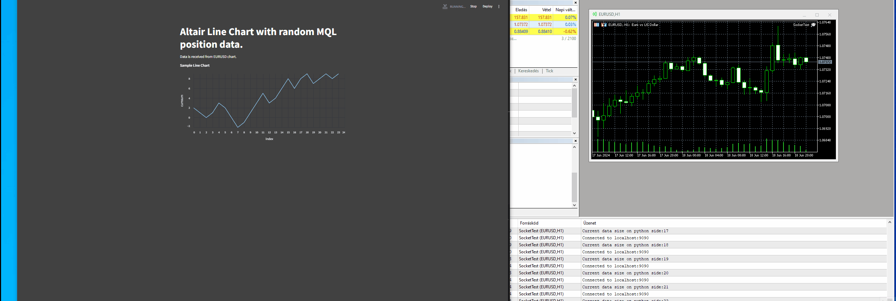

# Bind Python with MQL with socket

## About the Project

I created this project to demonstrate a method of using sockets to bind Python with MQL5. In this example, random position data is generated on the MQL side and sent to Python. In Python, a cumulative sum list is created and displayed using an Altair chart on Streamlit. The data from MQL is serialized to a JSON string, where each key contains a list of data. Simultaneously, a string data is sent to the MetaTrader terminal. One important step is to set up your terminal's web request to send/receive data via localhost.

### Example:

## License

**Copyright 2024, kisb-data **  
kisbalazs.data@gmail.com 

## License

This code is free software: you can redistribute it and/or modify it under the terms of the GNU General Public License as published by the Free Software Foundation, either version 3 of the License, or (at your option) any later version.

This code is distributed in the hope that it will be useful, but WITHOUT ANY WARRANTY; without even the implied warranty of MERCHANTABILITY or FITNESS FOR A PARTICULAR PURPOSE. See the GNU General Public License for more details.

You should have received a copy of the GNU General Public License along with this code. If not, see <http://www.gnu.org/licenses/>.

### Additional Terms:

You may not use this software in products that are sold.

Redistribution and use in source and binary forms, with or without modification, are permitted provided that the following conditions are met:

1. **Redistributions of source code** must retain the above copyright notice, this list of conditions and the following disclaimer.

2. **Redistributions in binary form** must reproduce the above copyright notice, this list of conditions and the following disclaimer in the documentation and/or other materials provided with the distribution.

3. Neither the name of the copyright holder nor the names of its contributors may be used to endorse or promote products derived from this software without specific prior written permission.

4. **Products that include this software may not be sold.**

## Warranty Disclaimer

THE SOFTWARE IS PROVIDED "AS IS", WITHOUT WARRANTY OF ANY KIND, EXPRESS OR IMPLIED, INCLUDING BUT NOT LIMITED TO THE WARRANTIES OF MERCHANTABILITY, FITNESS FOR A PARTICULAR PURPOSE AND NONINFRINGEMENT. IN NO EVENT SHALL THE AUTHORS OR COPYRIGHT HOLDERS BE LIABLE FOR ANY CLAIM, DAMAGES OR OTHER LIABILITY, WHETHER IN AN ACTION OF CONTRACT, TORT OR OTHERWISE, ARISING FROM, OUT OF OR IN CONNECTION WITH THE SOFTWARE OR THE USE OR OTHER DEALINGS IN THE SOFTWARE.

---